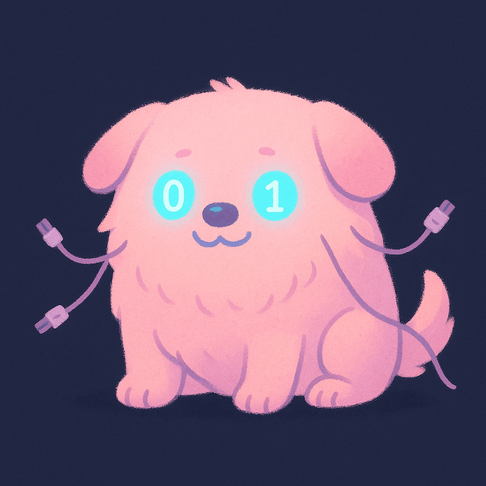

# Kernel Quests — Monster Module
Learn kernel programming the fun way — by playing inside it.

## What Is Kernel Quests
Kernel Quests is an experimental playground for exploring how the Linux kernel really behaves — not through dry academics, but through tiny inhabitants you build, load, and befriend.

Each quest is a self-contained kernel module that turns low-level concepts (character devices, interrupts, memory management, and more) into a playful arena. You don’t just read about mechanics; you march through `/dev`, trigger events, and duel—or dance—with the kernel itself.

## Meet the Monster Module
The debut quest, Monster, is a caretaker sim that lives entirely inside the kernel. It exposes `/dev/monster`, a window into the creature’s world where userspace helpers can:
- Guide the critter through interconnected rooms.
- Trigger state changes and react to kernel-driven events.
- Watch emergent behavior unfold from tightly scoped primitives.

Think of it as a hybrid between a game and a systems-engineering dojo. While you’re feeding the beast and cleaning its room, you’re also wielding:
- Kernel ↔ userspace comms
- Character device interfaces
- Event loops and state machines
- Scheduling, timing, and synchronization practices

## Project Structure
- `quests/monster/monster_main.c` — core kernel module implementation.
- `quests/monster/monster_client.py` — interactive userspace client.
- `quests/monster/tests/` — unit tests (`python -m unittest discover quests/monster/tests`).

## Getting Started
1. Build the module: `make -C quests/monster`
2. Insert it into the kernel: `sudo insmod quests/monster/monster.ko`
3. Connect to your monster: `./quests/monster/monster_client.py`

## Why Build Games in the Kernel?
Should you build games in the kernel? Probably not.
Should you use a monster to understand devices, concurrency, and memory? Absolutely.

Games make the invisible visible. Every quest turns opaque kernel machinery into something you can see, poke, and play with. The result: intuition that sticks.

## Join the Adventure
Add a new quest. Design a creature that teaches semaphores. Stage a DMA boss fight. Or just wander the rooms until the kernel nips you back.

Kernel Quests — because learning systems should feel alive.
